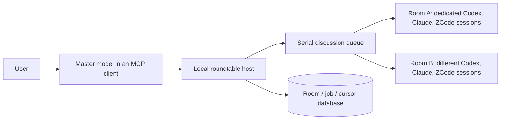

# A2A Roundtable

**One master leads. Persistent peers discuss. Each topic keeps its own context.**

[中文说明](README.zh-CN.md) · [Master workflow](MASTER.md) · [Operations](OPERATIONS.md) · [Security](SECURITY.md) · [Contributing](CONTRIBUTING.md)

A local Agent2Agent service for a coordinating model to consult Codex, Claude Code, and ZCode over time. You talk to your master model; it selects peers, asks follow-ups, evaluates disagreements, and reports back. Each topic has its own room and each peer keeps a native conversation. You do not need to operate a browser or manage the discussion manually.

The master is the model in your calling MCP client. The service does not start an additional autonomous master model. It supplies persistent peers and room-scoped recovery notes so that the calling model can lead the conversation.

- **Warm sessions:** provider processes stay alive between turns. After a service restart, the host resumes the saved native session IDs.
- **Room isolation:** messages, jobs, unread cursors, drafts, and native sessions belong to an explicit room. There is no implicit target room for requests.
- **Master-led consultations:** select one peer per question, read its actual answer, then decide the next step. The master controls when to stop and how to synthesize the result.
- **Master recovery:** save a room's goal, summary, open questions, and next action. Recover that checkpoint plus subsequent events without replaying the entire transcript into the master.
- **Finite roundtables:** choose participants and 1–5 rounds. Participants speak in order and see earlier contributions. They stop when the requested rounds finish.
- **Several entry points:** browser UI, HTTP, A2A v1.0 JSON-RPC/HTTP+JSON, and a small stdio MCP client.
- **Local persistence:** SQLite stores room events and job state. Only unseen room events are appended to a participant's existing native conversation.

## How it works



The host supports up to **8 warm rooms**. Rooms can submit jobs at the same time, but generation runs through one serial queue. Within a room, each participant has a separate process and conversation. These are dedicated roundtable sessions; the service does not attach to unrelated desktop chats.

## Requirements

The full three-participant runtime has been exercised on **macOS with Python 3.13**. Python 3.11+ is supported by the project. LaunchAgent management is macOS-specific; the foreground service uses Unix process groups and is not a Windows runtime.

Install [uv](https://docs.astral.sh/uv/) and the official clients you intend to use, and sign in through those clients:

| Participant | Runtime adapter | Existing login/configuration |
|---|---|---|
| Codex | `codex app-server` | Codex account and local configuration; uses its configured default model |
| Claude Code | `claude -p` with persistent stream JSON input | Claude Code login; tested with a Max subscription and `sonnet` |
| ZCode | official `zcode app-server` | ZCode Desktop configuration, `builtin:zai-coding-plan`; tested with `GLM-5.3-Flash` |

The adapters depend on installed client protocols. There are no bundled model binaries, account credentials, or model subscriptions. An unavailable participant is shown as an error; available participants can still be explicitly selected for a discussion.

## Quick start

```bash
git clone https://github.com/zhangsensen/a2a-roundtable.git
cd a2a-roundtable
uv sync --locked --group dev
uv run python roundtable.py
```

In a second terminal, run `uv run python service.py mcp-config` and add the printed entry to your master's MCP client using its supported setup flow. Reconnect MCP, then ask your master to consult the relevant peers. See the [master workflow](MASTER.md). The browser at **http://127.0.0.1:41241/** is optional.

For a persistent macOS service, first stop the foreground process with Ctrl-C, then run:

```bash
uv run python service.py install
uv run python service.py status
```

The installer creates only its own `io.github.a2a-roundtable` LaunchAgent. It does not rewrite model client configurations or disable other services. Keep the checkout and its `.venv` at the same path after installation.

If the port is already occupied, choose a different one consistently for the server and its clients:

```bash
A2A_PORT=41243 uv run python roundtable.py
A2A_PORT=41243 uv run python ask.py --context-id lobby 'Continue our discussion'
```

## Use the rooms explicitly

Create an independent topic:

```bash
curl -sS http://127.0.0.1:41241/api/rooms \
  -H 'Content-Type: application/json' \
  -d '{"id":"architecture","title":"Architecture discussion"}'
```

Post to that room and schedule two rounds:

```bash
curl -sS http://127.0.0.1:41241/api/rooms/architecture/messages \
  -H 'Content-Type: application/json' \
  -d '{"text":"Compare the two designs from our last discussion.","members":["codex","claude","zcode"],"rounds":2,"requestId":"architecture-review-001"}'
```

The response is a job receipt, not the completed discussion. Read it using **both** its job ID and room:

```bash
curl -sS 'http://127.0.0.1:41241/api/jobs/JOB_ID?room=architecture'
```

Or use the A2A CLI, which waits for a terminal task:

```bash
uv run python ask.py --context-id architecture 'What remains unresolved?'
```

Reuse a room ID to continue the same topic. Create another room for an unrelated topic. Reuse the same `requestId` when retrying an uncertain HTTP/MCP submission with identical content.

## MCP

Print a configuration fragment with the correct absolute interpreter and script paths:

```bash
uv run python service.py mcp-config
```

Add the resulting entry to your client's MCP configuration using its supported setup flow, then reconnect MCP. For clients using TOML, the equivalent structure is:

```toml
[mcp_servers.a2a-roundtable]
command = "/absolute/path/to/a2a-roundtable/.venv/bin/python"
args = ["/absolute/path/to/a2a-roundtable/roundtable_mcp.py"]
```

Master workflow: `roundtable_rooms` / `roundtable_create_room` → `roundtable_context` → `roundtable_consult` → `roundtable_job` → follow-up consultations as needed → `roundtable_checkpoint` → report to the user.

`roundtable_consult` asks exactly one peer once. Supply a stable `requestId` and use `roundtable_job` with optional `waitSeconds` (0–25) to read its result. Waiting does not invoke models or resubmit a request. `roundtable_context` returns a checkpoint and subsequent events with explicit pagination. Checkpoint revisions reject stale overwrites; exact retries are idempotent.

The existing `roundtable_status`, `roundtable_post`, `roundtable_history`, and `roundtable_cancel` tools remain available. `roundtable_post` is the optional fixed-round mode; adaptive master-led discussion uses `roundtable_consult`.

All consultation, context, checkpoint, post, history, job, and cancel operations require an explicit `room`. The MCP process is just a client; reconnecting it does not restart model conversations.

## Configuration

Set environment variables before launching the service. `.env.example` documents the supported variables, but files are **not automatically loaded**.

| Variable | Default / purpose |
|---|---|
| `A2A_PORT` | `41241`; loopback port, also used by CLI/MCP clients |
| `A2A_ROOM_DATA` | `data/roundtable` under the checkout |
| `A2A_CODEX_BIN`, `A2A_CLAUDE_BIN`, `A2A_ZCODE_BIN` | Optional executable paths; otherwise resolve from PATH and common user installation directories |
| `A2A_CLAUDE_MODEL` | `sonnet` |
| `A2A_ZCODE_MODEL` | `GLM-5.3-Flash` |
| `A2A_ZCODE_CONFIG` | `~/.zcode/v2/config.json`; existing Desktop provider configuration |
| `CODEX_HOME` | Existing Codex home override, if you already use one |

ZCode provider credentials are read from the user's existing local Desktop configuration and sent only to its official app-server over private stdin. They are not copied into this repository or stored in room records, command arguments, or logs. See [security boundaries](SECURITY.md).

## Validation and limits

```bash
uv run pytest -q
node --check roundtable_ui.js
python3 scripts/check_publication.py --worktree
```

Offline tests use fake members and require no model credentials. Optional real-model probes consume provider usage:

```bash
uv run python native_acceptance.py
uv run python native_room_acceptance.py
```

The two-room probe creates six native sessions, gives the rooms different synthetic facts, checks continuous recall, closes all processes, then resumes the saved IDs and checks recall without injecting the original facts. Its local reports are ignored by Git.

Warm processes do not provide unlimited context, permanent provider prompt-cache retention, or free inference. Native context windows and compaction still apply. Interrupted turns are not silently replayed because the provider may already have processed them.

The service listens on loopback and has no multi-user authentication. Room isolation prevents accidental topic mixing; it is not an access-control boundary between untrusted local users. Never expose it through a public proxy. The discussion policy and client permission settings restrict actions, but the adapters are not an OS-level sandbox.

## License

[MIT](LICENSE) for this project's code. Third-party SDKs and model clients retain their own licenses and account terms; they are not redistributed here.
