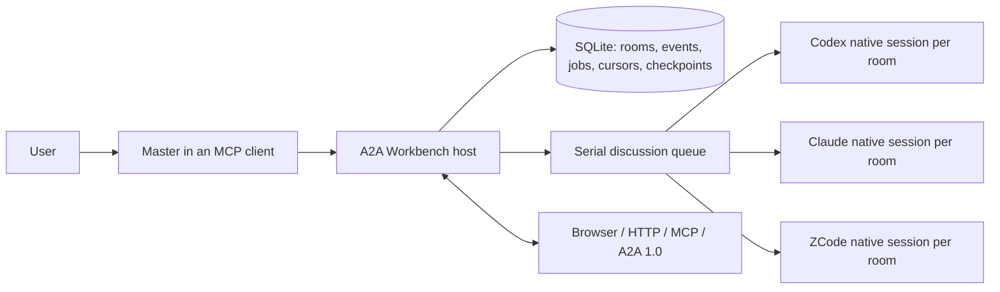

# A2A Workbench

**Open collaboration for independent coding agents.**

Connect Claude Code, Codex, ZCode, and other agent runtimes through persistent, topic-scoped rooms. A coordinating model can consult peers, preserve context across sessions, track disagreements, and hand work forward without turning every participant into its private subagent.

[中文说明](README.zh-CN.md) · [Changelog](CHANGELOG.md) · [Design references](REFERENCES.md) · [Master workflow](MASTER.md) · [Operations](OPERATIONS.md) · [Security](SECURITY.md) · [Contributing](CONTRIBUTING.md)

> **Current release:** persistent collaboration rooms over MCP, HTTP, and A2A 1.0 are implemented. Isolated worktree execution and machine-verified delivery are the next product layer and are not claimed as part of the current public release.

## Why A2A Workbench

Coding work increasingly spans several independent agent sessions: one investigates, another implements, another reviews, and another tests. Today the human often becomes the router—copying context between terminals, repeating decisions, and reconstructing what happened after sessions end.

A2A Workbench provides a durable collaboration layer:

- **Independent agents, not private subagents** — participants keep their own runtime, identity, and native conversation.
- **Persistent topic context** — each room has its own event stream, unread cursors, member sessions, jobs, and master checkpoint.
- **Master-led coordination** — the model already talking to the user selects peers, investigates disagreements, and produces the final judgment.
- **Open interfaces** — browser UI, HTTP, MCP, and standard A2A 1.0 transports share the same room state.
- **Local-first operation** — SQLite stores collaboration state on the host; model credentials remain with official clients.
- **Conservative recovery** — uncertain interrupted turns are recorded, not silently replayed.

The project’s north star is simple:

> Reduce the total time and human coordination needed to turn one goal into a verified engineering result.

## Problems it solves

| Problem | Workbench response |
|---|---|
| Context is repeatedly copied between independent agent sessions | Room-scoped event streams, unread cursors, and resumable native conversations |
| A parent agent must own and recreate every helper as a private subagent | Independent peers keep their own identity and runtime; the calling model coordinates them through MCP/A2A |
| Long discussions lose decisions and unresolved objections | Revision-checked master checkpoints preserve goals, summaries, open questions, and next actions |
| Retries can trigger duplicate model work | Stable request IDs make exact retries idempotent and reject changed payloads |
| A restart can silently repeat an uncertain model turn | Running turns become `interrupted`; recorded replies remain inspectable and replay requires a new explicit decision |
| Multiple topics leak context into one another | Rooms validate event cursors, task ownership, and native-session ownership before provider input and persistence |
| A receipt or model claim is mistaken for a result | Jobs expose explicit states and recorded replies; the master must read the terminal result before reporting |

A2A Workbench does not replace the coding agents, their subscriptions, or their native context systems. It coordinates the clients the user already operates.

## Version status

The public package is currently **v0.3.0**. The repository was renamed from **A2A Roundtable** to **A2A Workbench** on 2026-09-07; compatibility identifiers remain unchanged in v0.3.x.

| Version | Milestone |
|---|---|
| `v0.1` | Initial local A2A discussion prototype |
| `v0.2` | Persistent multi-room host, isolated native sessions, HTTP/MCP/A2A surfaces, recovery and room-boundary tests |
| `v0.3` | Master-led single-peer consultations, revisioned room checkpoints, pagination, exact retry semantics, and improved cancellation/recovery |
| Next | Isolated worktree execution and machine-verified delivery, after those capabilities are transferred into the public repository and independently validated |

See [CHANGELOG.md](CHANGELOG.md) for release details. Until a tagged release is published, `main` is the source of truth for v0.3.x.

## What is implemented today

### Persistent rooms

Every topic has an explicit room. Messages, jobs, unread positions, native sessions, drafts, and master checkpoints are room-scoped. There is no implicit target room.

### Native conversation continuity

Each `(room, member)` owns a separate native conversation. New consultations send only events that member has not seen. After service restart, the host resumes the saved native session ID instead of rebuilding the conversation from a transcript.

### Adaptive master-led consultation

The calling model is the master. It can:

1. recover a room checkpoint and subsequent events;
2. consult one useful peer with a focused question;
3. read the actual reply;
4. challenge a claim with another peer when necessary;
5. save unresolved questions and the next action;
6. report its own synthesis to the user.

The server does not start a second autonomous master or force every member to speak.

### Finite roundtables

For bounded discussions, select participants and 1–5 rounds. Members speak in order and see only new room events. The job stops when the requested rounds finish.

### Durable and explicit recovery

- Exact request retries are idempotent.
- Master checkpoints use revision checks to prevent stale overwrites.
- Running jobs interrupted by restart become `interrupted`; the host does not blindly replay a potentially billed or completed model turn.
- Task lookup and cancellation verify room ownership.

## Architecture



The current host supports up to eight warm rooms. Different rooms may queue work concurrently, while model generation is serialized. Native model context windows and provider compaction still apply.

## Quick start

### Requirements

- Python 3.11+
- [uv](https://docs.astral.sh/uv/)
- At least one supported official coding-agent client, installed and authenticated

| Participant | Runtime adapter | Existing local setup |
|---|---|---|
| Codex | `codex app-server` | Codex account and local configuration |
| Claude Code | `claude -p` with stream JSON | Claude Code login; default model `sonnet` |
| ZCode | official `zcode app-server` | ZCode Desktop provider configuration |

```bash
git clone https://github.com/zhangsensen/a2a-workbench.git
cd a2a-workbench
uv sync --locked --group dev
uv run python roundtable.py
```

The optional browser UI is available at:

```text
http://127.0.0.1:41241/
```

In another terminal, print the MCP configuration:

```bash
uv run python service.py mcp-config
```

Add the generated entry to your master client, reconnect MCP, and ask it to create or reuse a room and consult the relevant peers. See [MASTER.md](MASTER.md) for the complete workflow.

## MCP workflow

Typical adaptive flow:

```text
roundtable_rooms / roundtable_create_room
→ roundtable_context
→ roundtable_consult
→ roundtable_job
→ optional follow-up consultations
→ roundtable_checkpoint
→ master reports to the user
```

Core tools:

| Tool | Purpose |
|---|---|
| `roundtable_rooms` | List persistent rooms |
| `roundtable_create_room` | Create a topic-scoped room |
| `roundtable_context` | Recover the master checkpoint and subsequent events |
| `roundtable_consult` | Ask one selected persistent peer once |
| `roundtable_job` | Read a job receipt and actual replies |
| `roundtable_checkpoint` | Save goal, summary, unresolved questions, and next action |
| `roundtable_post` | Run a fixed 1–5 round discussion |
| `roundtable_history` | Read room events without consuming them |
| `roundtable_cancel` | Cancel a scoped queued/running job |

A receipt is not an answer. Read the job until it reaches a terminal state; do not resubmit a consultation merely to poll.

## HTTP example

Create a room:

```bash
curl -sS http://127.0.0.1:41241/api/rooms \
  -H 'Content-Type: application/json' \
  -d '{"id":"architecture","title":"Architecture discussion"}'
```

Ask two peers for one bounded round:

```bash
curl -sS http://127.0.0.1:41241/api/rooms/architecture/messages \
  -H 'Content-Type: application/json' \
  -d '{"text":"Review the migration plan.","members":["codex","claude"],"rounds":1,"requestId":"architecture-review-001"}'
```

Read the result with both job and room identity:

```bash
curl -sS 'http://127.0.0.1:41241/api/jobs/JOB_ID?room=architecture'
```

Reuse the same `requestId` only for an exact uncertain retry.

## Configuration

Export settings before starting the service. `.env.example` documents them; `.env` files are not loaded automatically.

| Variable | Purpose |
|---|---|
| `A2A_PORT` | Loopback service port; default `41241` |
| `A2A_ROOM_DATA` | Persistent room data directory |
| `A2A_CODEX_BIN` | Optional Codex executable override |
| `A2A_CLAUDE_BIN` | Optional Claude executable override |
| `A2A_ZCODE_BIN` | Optional ZCode executable override |
| `A2A_CLAUDE_MODEL` | Claude model alias; default `sonnet` |
| `A2A_ZCODE_MODEL` | ZCode model; default `GLM-5.3-Flash` |
| `A2A_ZCODE_CONFIG` | Existing ZCode Desktop configuration |
| `CODEX_HOME` | Existing Codex home override |

Credentials stay in official client configuration. A2A Workbench does not bundle model binaries, API keys, or subscriptions.

## Safety boundary

A2A Workbench is a single-user local development tool.

- It binds to loopback by default.
- Room IDs are routing boundaries, not secrets.
- Peer messages cannot authorize file changes, shell execution, deployment, external messaging, or more background work.
- Claude runs without tools; Codex uses a read-only sandbox; ZCode uses plan mode with a restricted tool allowlist.
- These controls are not an OS sandbox. Run only clients you trust.
- Never expose the service through a public proxy without adding an appropriate authentication and isolation layer.

See [SECURITY.md](SECURITY.md) for the full data and process boundary.

## Validation

```bash
uv run pytest -q
node --check roundtable_ui.js
python3 scripts/check_publication.py --worktree
```

Offline tests use fake members and require no model subscription. Optional real-provider probes consume usage:

```bash
uv run python native_acceptance.py
uv run python native_room_acceptance.py
```

## Design references

The design was informed by several open-source projects, while the implementation in this repository was written independently:

- [A2A Protocol](https://github.com/a2aproject/A2A) — standard Agent Card discovery, task lifecycle, messages, artifacts, and transports.
- [Claw Orchestrator](https://github.com/Enderfga/claw-orchestrator) — persistent programmable CLI sessions and multi-engine orchestration.
- [Agent Room](https://github.com/agent-room-alkl/agent-room) — shared rooms, explicit collaboration turns, and durable project context.
- [Peertable](https://github.com/kitepon/peertable) — long-lived peers and retained room history.

A2A Workbench deliberately differs by keeping the user-facing model as the master, preserving one native conversation per room/member, and treating peer messages as discussion rather than execution authority. See [REFERENCES.md](REFERENCES.md) for the detailed adopted/rejected design choices and license notes.

## Product direction

The current release establishes the collaboration and context layer. The next layer is a verified delivery loop:

```text
one user goal
→ one master
→ independent agents in isolated worktrees
→ machine-checked delivery
→ master integration
→ results return to the same persistent context
```

Planned work includes configurable agent adapters, isolated workspace execution, structured delivery evidence, and a unified workflow connecting persistent rooms to verified code changes. These are roadmap items until they are shipped in the public repository.

## Compatibility note

The Python distribution and macOS LaunchAgent label retain `a2a-roundtable` in v0.3.x for compatibility. New MCP configuration and user-facing service metadata use **A2A Workbench**. The remaining compatibility identifiers will change only through an explicit migration.

## License

[MIT](LICENSE). Third-party SDKs and model clients retain their own licenses and account terms.
