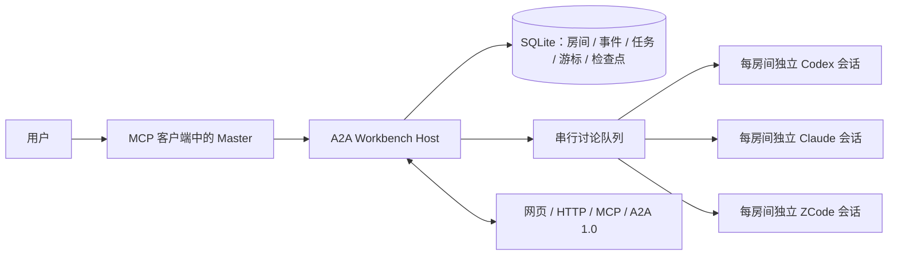

# A2A Workbench · 开放式 Coding Agent 协作工作台

**让彼此独立的 Coding Agent 持续协作，而不是被锁在某个主 Agent 的私有 subagent 树里。**

[English](README.md) · [版本记录](CHANGELOG.md) · [设计参照](REFERENCES.md) · [Master 主持流程](MASTER.md) · [运行说明](OPERATIONS.md) · [安全边界](SECURITY.md) · [参与贡献](CONTRIBUTING.md)

> **当前公开版本：** 已实现基于 MCP、HTTP 和标准 A2A 1.0 的持久协作房间。隔离 worktree 执行和机器验证交付是下一层产品能力，尚未作为当前公开版本的已交付功能宣传。

## 为什么做 A2A Workbench

真实软件开发正在同时使用多个 Agent：一个调查、一个实现、一个测试、一个审查。今天通常由人充当路由器，在多个终端之间复制背景、转述决定、追问进度，并在会话结束后重新拼接发生了什么。

A2A Workbench 提供一层持久协作基础：

- **独立 Agent，不是私有子代理**：参与者保留自己的运行时、身份和原生会话。
- **议题级持久上下文**：每个房间独立保存事件、未读游标、成员会话、任务和主持检查点。
- **Master 主导**：当前与用户对话的模型选择咨询谁、是否追问、何时结束，并承担最终判断。
- **开放入口**：网页、HTTP、MCP 和标准 A2A 1.0 共用同一份房间状态。
- **本地优先**：SQLite 保存在本机；模型凭据继续由官方客户端管理。
- **保守恢复**：结果不确定的中断不会被静默重放。

项目的北极星只有一个：

> **减少从一个目标到经过验收的工程结果所需的总时间和人工协调。**

## 解决的问题

| 问题 | Workbench 的处理方式 |
|---|---|
| 独立 Agent 会话之间反复复制上下文 | 房间事件流、成员未读游标和可恢复的原生会话 |
| 主 Agent 必须私有创建并持有所有 subagent | Peer 保持独立身份与运行时，当前 Master 通过 MCP/A2A 组织协作 |
| 长讨论容易丢失决定和未解决分歧 | 带 revision 的 Master 检查点保存目标、摘要、问题和下一步 |
| 网络重试可能重复调用模型 | 稳定 requestId 使完全相同的重试幂等，不同内容复用同 ID 会被拒绝 |
| 服务重启可能重复一个结果不确定的模型轮次 | 运行中任务变为 `interrupted`，保留已记录回答，不静默重放 |
| 多个议题之间发生上下文串线 | 在模型输入和结果落盘前校验房间、游标、任务和原生会话归属 |
| 把回执或模型自述误当成结果 | Job 暴露明确状态和实际回复；Master 必须读取终态后才能汇报 |

A2A Workbench 不替代 Coding Agent、模型订阅或它们自己的上下文系统，而是协调用户已经在使用的客户端。

## 版本状态

当前公开包版本为 **v0.3.0**。仓库于 2026-09-07 从 **A2A Roundtable** 改名为 **A2A Workbench**；v0.3.x 暂时保留旧内部标识以兼容已有安装。

| 版本 | 里程碑 |
|---|---|
| `v0.1` | 最初的本地 A2A 讨论原型 |
| `v0.2` | 持久多房间 Host、原生会话隔离、HTTP/MCP/A2A 接口、重启恢复和房间边界测试 |
| `v0.3` | Master 单 Peer 咨询、带 revision 的房间检查点、分页、精确重试语义，以及更完整的取消和恢复 |
| 下一层 | 隔离 worktree 执行与机器验证交付；迁入公开仓库并完成独立验收后才作为已交付功能发布 |

版本详情见 [CHANGELOG.md](CHANGELOG.md)。正式 tag 发布前，`main` 是 v0.3.x 的事实来源。

## 当前已实现

### 持久房间

每个议题使用明确的房间 ID。消息、任务、未读位置、原生会话、草稿和 Master 检查点全部按房间隔离，没有隐式默认房间。

### 原生会话连续性

每个 `(room, member)` 有独立的原生会话。下一次咨询只追加该成员尚未看到的房间事件。服务重启后恢复已保存的原生会话 ID，而不是每次重放整段 transcript。

### 自适应 Master 咨询

当前调用 MCP 的模型就是 Master。它可以：

1. 恢复房间检查点和后续新事件；
2. 针对当前不确定性选择一名成员；
3. 读取真实回答；
4. 必要时让另一位成员挑战具体观点；
5. 保存剩余分歧和下一步；
6. 最终直接向用户汇报自己的判断。

服务不会额外启动第二个自主 Master，也不会要求所有成员机械轮流发言。

### 有限轮次圆桌

需要固定讨论时，可选择成员并设置 1–5 轮。成员按顺序发言，只看到新增事件，轮次结束后任务即结束。

### 可恢复、可审计的任务

- 相同请求的精确重试具有幂等性；
- Master 检查点使用 revision 防止旧摘要覆盖新进展；
- 服务重启时，结果不确定的运行中任务变为 `interrupted`，不会盲目重复调用模型；
- 查询和取消任务必须同时验证房间与任务归属。

## 架构



当前最多支持 8 个 warm rooms。多个房间可以排队提交任务，但模型生成串行执行。持久会话不代表无限上下文，仍受模型窗口、压缩和供应商缓存规则限制。

## 快速开始

### 依赖

- Python 3.11+
- [uv](https://docs.astral.sh/uv/)
- 至少一个已经安装并登录的官方 Coding Agent 客户端

| 成员 | 适配方式 | 本地已有配置 |
|---|---|---|
| Codex | `codex app-server` | Codex 账号和本地配置 |
| Claude Code | `claude -p` + stream JSON | Claude Code 登录，默认 `sonnet` |
| ZCode | 官方 `zcode app-server` | ZCode Desktop provider 配置 |

```bash
git clone https://github.com/zhangsensen/a2a-workbench.git
cd a2a-workbench
uv sync --locked --group dev
uv run python roundtable.py
```

可选网页入口：

```text
http://127.0.0.1:41241/
```

另开终端输出 MCP 配置：

```bash
uv run python service.py mcp-config
```

把输出加入 Master 客户端并重连，然后让 Master 创建或复用房间、咨询适合的成员。完整流程见 [MASTER.md](MASTER.md)。

## MCP 主流程

```text
roundtable_rooms / roundtable_create_room
→ roundtable_context
→ roundtable_consult
→ roundtable_job
→ 必要的后续咨询
→ roundtable_checkpoint
→ Master 向用户汇报
```

核心工具：

| 工具 | 用途 |
|---|---|
| `roundtable_rooms` | 列出持久房间 |
| `roundtable_create_room` | 创建议题房间 |
| `roundtable_context` | 恢复主持检查点和后续事件 |
| `roundtable_consult` | 指定一名持久成员咨询一次 |
| `roundtable_job` | 查询任务回执和真实回答 |
| `roundtable_checkpoint` | 保存目标、摘要、分歧和下一步 |
| `roundtable_post` | 发起固定 1–5 轮讨论 |
| `roundtable_history` | 读取历史，不消费消息 |
| `roundtable_cancel` | 取消指定房间中的任务 |

回执不等于答案。应使用 `roundtable_job` 等待终态，不要通过重复提交来轮询。

## HTTP 示例

创建房间：

```bash
curl -sS http://127.0.0.1:41241/api/rooms \
  -H 'Content-Type: application/json' \
  -d '{"id":"architecture","title":"架构讨论"}'
```

发起一轮讨论：

```bash
curl -sS http://127.0.0.1:41241/api/rooms/architecture/messages \
  -H 'Content-Type: application/json' \
  -d '{"text":"审核迁移方案。","members":["codex","claude"],"rounds":1,"requestId":"architecture-review-001"}'
```

查询结果：

```bash
curl -sS 'http://127.0.0.1:41241/api/jobs/JOB_ID?room=architecture'
```

只有在响应丢失、内容完全相同时，才复用原 `requestId` 重试。

## 配置

启动服务前导出环境变量。`.env.example` 只作说明，项目不会自动加载 `.env`。

| 变量 | 用途 |
|---|---|
| `A2A_PORT` | 回环服务端口，默认 `41241` |
| `A2A_ROOM_DATA` | 持久房间数据目录 |
| `A2A_CODEX_BIN` | Codex 可执行文件覆盖 |
| `A2A_CLAUDE_BIN` | Claude 可执行文件覆盖 |
| `A2A_ZCODE_BIN` | ZCode 可执行文件覆盖 |
| `A2A_CLAUDE_MODEL` | Claude 模型别名，默认 `sonnet` |
| `A2A_ZCODE_MODEL` | ZCode 模型，默认 `GLM-5.3-Flash` |
| `A2A_ZCODE_CONFIG` | 已有 ZCode Desktop 配置 |
| `CODEX_HOME` | 已有 Codex home 覆盖 |

Workbench 不捆绑模型二进制、API Key 或订阅；凭据留在官方客户端中。

## 安全边界

A2A Workbench 当前是单用户本地开发工具：

- 默认只监听回环地址；
-房间 ID 是路由边界，不是密钥；
-Peer 发言不能授权文件修改、Shell 执行、部署、外部消息或新增后台工作；
-Claude 禁用工具，Codex 使用只读 sandbox，ZCode 使用 plan 模式和有限工具；
-这些设置不是操作系统级沙箱，只运行你信任的客户端；
-不要在没有额外认证和隔离的情况下通过公网代理暴露。

详见 [SECURITY.md](SECURITY.md)。

## 验证

```bash
uv run pytest -q
node --check roundtable_ui.js
python3 scripts/check_publication.py --worktree
```

离线测试使用假成员，不需要模型订阅。以下真实模型验收会消耗额度：

```bash
uv run python native_acceptance.py
uv run python native_room_acceptance.py
```

## 设计参照

设计过程中参考了以下开源项目，但本仓库实现为独立编写：

- [A2A Protocol](https://github.com/a2aproject/A2A)：Agent Card 发现、任务生命周期、消息、Artifact 和标准传输。
- [Claw Orchestrator](https://github.com/Enderfga/claw-orchestrator)：持久 CLI 会话和多执行引擎编排。
- [Agent Room](https://github.com/agent-room-alkl/agent-room)：共享房间、明确协作轮次和项目上下文。
- [Peertable](https://github.com/kitepon/peertable)：长寿命 Peer 与保留的房间历史。

Workbench 的明确取舍是：当前与用户对话的模型担任 Master；每个房间/成员保留独立原生会话；Peer 发言只构成讨论，不构成执行授权。详细采纳、拒绝项及许可证说明见 [REFERENCES.md](REFERENCES.md)。

## 产品方向

当前公开版本先建立协作和上下文层。下一层是经过验证的代码交付闭环：

```text
一个用户目标
→ 一个 Master
→ 独立 Agent 在隔离 worktree 中开发
→ 机器验证交付
→ Master 集成
→ 结果回到同一份持久上下文
```

规划中的能力包括可配置 Agent Adapter、隔离 workspace、结构化 Delivery Evidence，以及将持久房间连接到经过验证的代码修改。在它们进入公开仓库前，不作为当前版本已交付功能宣传。

## 兼容性说明

Python distribution 与 macOS LaunchAgent 在 v0.3.x 暂时保留 `a2a-roundtable` 标识，避免现有安装立即失效；新的 MCP 配置和用户可见服务元数据使用 **A2A Workbench**。其余兼容标识只会通过明确迁移修改。

## 许可证

项目代码使用 [MIT](LICENSE)。第三方 SDK、模型客户端和账号遵循各自许可证与服务条款。
